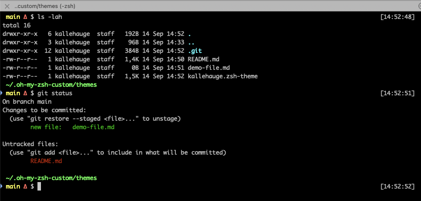

# Oh My Zsh Theme

Pretty run-of-the-mill [Oh My Zsh](https://ohmyz.sh/) theme based on [the "pmcgee" theme](https://github.com/ohmyzsh/ohmyzsh/blob/master/themes/pmcgee.zsh-theme) with some adjustments to satisfy personal requirements.

## Screenshots

## Installation

_To use this theme with Oh My Zsh:_

1. Copy the `kallehauge.zsh-theme` file to your Oh My Zsh custom themes directory (usually `~/.oh-my-zsh/custom/themes/`)
2. Update your `~/.zshrc` file to include the following line: ZSH_THEME="kallehauge"
3. Restart your terminal or run `source ~/.zshrc` to apply the changes
